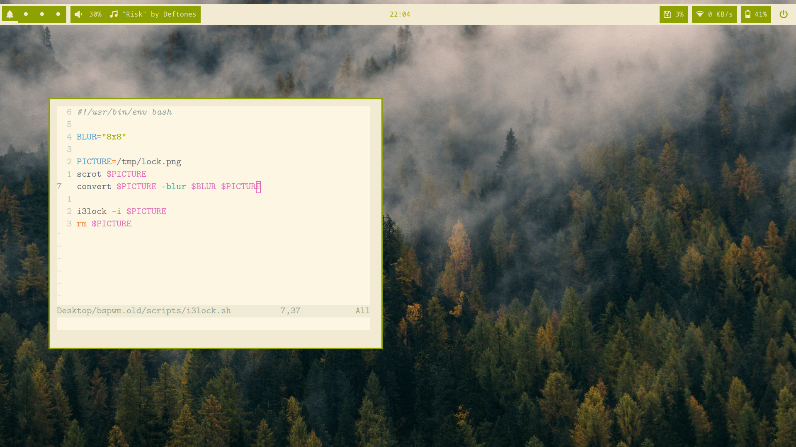

# Linux Dotfiles



These are the dotfiles for my customized Linux experience.
As opposed to my MacOS dotfiles, this rice focuses on the
everforest aesthetic with a lightweight typewriter font.

## Install

**Note**: The install script assumes uses `yay` to install packages,
so if you are on an arch-based distro you need to have that and if
you aren't you need to install the packages manually.

```sh
cd ~
git clone -b linux https://github.com/pbogre/dotfiles
cd dotfiles/linux
chmod +x install
./install  
```

Once the installation starts, almost everything will work on its own and the
following content will be installed:

- various dependencies for the rice like polybar and rofi
- some basic applications like firefox and discord
- oh-my-zsh
- all my neovim plugins

User input is needed to exit the :CocInstall page, as if i do that in the script
the downloads dont actually finish.
To do this, simply type `:qa`.

User input is also needed for sudo permission to enable the `light` program
to run without sudo in the future, and at the end of the installation
you must enter your password to change your default shell to zsh.
